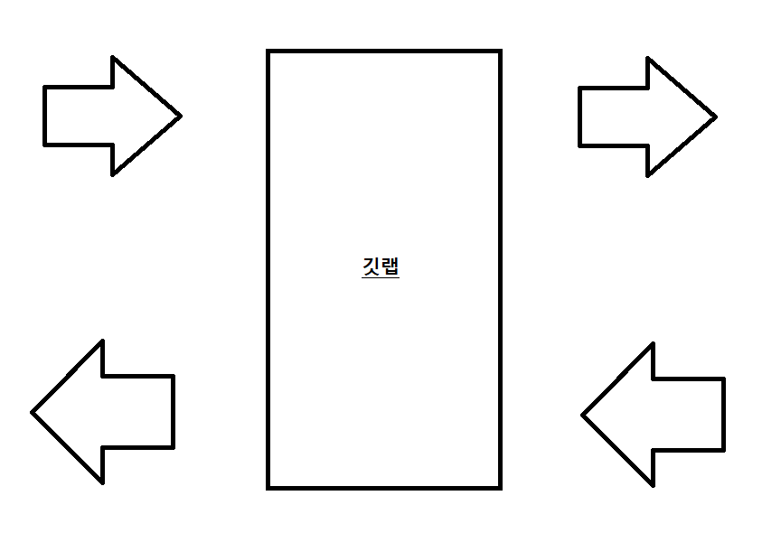

<h1>Windows-To-Linux-Dev-Server-Connection</h1>

윈도우에서 개발한 소스파일 혹은 폐쇄망 리눅스 상에 파일을 다운, 업로드 하기 위한 프로그램을 생성하였습니다.

<h1>목차</h1>
<ul>
  <li>목적</li>
  <li>명령어 구현</li>
  <li>결과</li>
</ul>

<h1>목적</h1>

윈도우에서 개발한 소스파일 혹은 리눅스 상에 파일을 다운, 업로드 하기 위한 프로그램을 생성하였습니다.

<h1>처리 방법</h1>

업로드의 경우, 깃랩 서버를 통하여 윈도우에서 파일을 받아서 scp 방식으로 리눅스 서버에 업로드하게 됩니다.

다운로드의 경우 sftp 방식으로 리눅스 서버에서 윈도우 서버까지 다운로드 하도록 구현되어 있습니다.

<h1>지원되는 확장자</h1>

일반적으로 모든 확장자는 지원 가능하게 만들었지만, 폴더는 지원되지 않습니다. 

따라서 폴더를 압축하시고 압축한 파일을 넣으시면 가능하겠습니다.

또한, 여러파일의 업로드는 가능하지만 다운로드는 오직 한 파일만 가능합니다. 

차후에 불편한 점이 있으면 이러한 점을 개선할 예정입니다.

<h1>포맷</h1>
<h2>업로드</h2>

<table>
    <tr>
        <th>URI</th>
        <th>Method</th>
        <th>전송 json</th>
        <th>결과 json</th>
    </tr>
    <tr>
        <td>http://ip:port/filecontrol/upload</td>
        <td>POST</td>
        <td>
          {
          “file”: file,
          “userId”: userId,
          “dupCheck”: “true”,
          “serverIp”: serverIp,
          “serverId”: serverId,
          “serverPw”: serverPw,
          “path”: path
          }
      </td>        
      <td>
        {
    "result": {
        "resultCode": "00",
        "resultMessage": "성공"
    },
    "file": [
        {
            "fileName": "autos.py",
            "fileSize": 114,
            "fileUri": "/home/jongsun/20210526/kimjunho/autos.py"
        },
        {
            "fileName": "blob.json",
            "fileSize": 163,
            "fileUri": "/home/jongsun/20210526/kimjunho/blob.json"
        },
        {
            "fileName": "GBIZ API specification_1.0_운영공지최종.pdf",
            "fileSize": 731645,
            "fileUri": "/home/jongsun/20210526/kimjunho/GBIZ API specification_1.0_운영공지최종.pdf"
        },
        {
            "fileName": "gbiz_test_py27.py",
            "fileSize": 4534,
            "fileUri": "/home/jongsun/20210526/kimjunho/gbiz_test_py27.py"
        },
        {
            "fileName": "gbiz_test_py37.py",
            "fileSize": 3642,
            "fileUri": "/home/jongsun/20210526/kimjunho/gbiz_test_py37.py"
        },
        {
            "fileName": "gbizSampleV2_1.html",
            "fileSize": 5079,
            "fileUri": "/home/jongsun/20210526/kimjunho/gbizSampleV2_1.html"
        },
        {
            "fileName": "test copy.py",
            "fileSize": 606,
            "fileUri": "/home/jongsun/20210526/kimjunho/test copy.py"
        },
        {
            "fileName": "test.py",
            "fileSize": 606,
            "fileUri": "/home/jongsun/20210526/kimjunho/test.py"
        },
        {
            "fileName": "tone.wav",
            "fileSize": 444524,
            "fileUri": "/home/jongsun/20210526/kimjunho/tone.wav"
        }
    ]
}
      </td>
    </tr>
</table>

<h2>다운로드</h2>

<table>
    <tr>
        <th>URI</th>
        <th>Method</th>
        <th>전송 json</th>
        <th>결과 json</th>
    </tr>
    <tr>
        <td>http://ip:port/filecontrol/download</td>
        <td>POST</td>
        <td>
          {
          “userId” userId,
          “fileName”: fileName,
          “serverIp”: serverIp,
          “serverId”: serverId,
          “serverPw”: serverPw,
          “path”: path
          }
      </td>        
      <td>
          {
              "result": {
                  "resultCode": "00",
                  "resultMessage": "성공"
              },
              "file": [
                  {
                      "fileUri": "http://ip:port/filecontrol/download/file?userId=kimjunho&fileName=webfront.zip"
                  }
              ]
          }
      </td>
    </tr>
</table>
